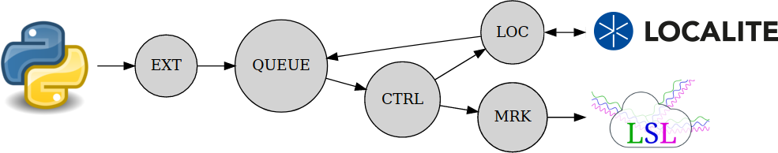

 [](https://en.wikipedia.org/wiki/MIT_License) [](https://github.com/pyreiz/ctrl-localite/actions) [](https://coveralls.io/github/pyreiz/ctrl-localite?branch=master) [](https://ctrl-localite.readthedocs.io/en/latest/?badge=latest)

ctrl-localite
------------

This package allows you to stream the current settings and messages from your [localite TMS Navigator](https://www.localite.de/en/home/>) as [LSL stream](https://labstreaminglayer.readthedocs.io/) Additionally, it allows you to control the TMS device connected to the localite software over an api.

This package has been developed using MagVenture TMS devices connected with localite TMS Navigator, and with a beta version of TMS Navigator 4.0.

Documentation
-------------

A slightly more extensive documentation can be found on [readthedocs](https://ctrl-localite.readthedocs.io/en/latest/?badge=latest).

Installation
------------

``` bash
    git clone git@github.com:pyreiz/ctrl-localite.git
    cd ctrl-localite
    pip install .
```

Basic Usage
-----------

Usage of the API depends on a running localite-flow Server. Start this server ideally from the command line using e.g. ``localite-flow --host HOST`` with HOST the ip-adress of your localite PC.

    usage: localite-flow [-h] [--host HOST] [--kill]

    optional arguments:
    -h, --help   show this help message and exit
    --host HOST  The IP-Adress of the localite-PC
    --kill


After that, you can use the python API to access the stream and control TMS Navigator remotely.

``` python
    from localite.api import Coil
    coil = Coil(0) # initializes the api for coil 1 (of e.g. 2)

    coil.amplitude = 30 # sets the amplitude of this coil to 30% MSO
    coil.trigger() # triggers the coil

    coil.push_marker("Experiment finished") # publishes a marker over LSL
```


Information Flow
----------------

Information flows within the server in a relatively complex fashion. There is an EXT listening to messsages sent over the API, which are queued to be delivered to LOC, where they are sent to the localite PC. Concurrently, LOC is constantly listening for messages from the localite PC and sends them indirectly to MRK, where these messages are pubklished in an LSL Marker StreamOutlet. This allows you to publish additional markers over the API, and additonally supports easy automated logging of any command sent to localite.

