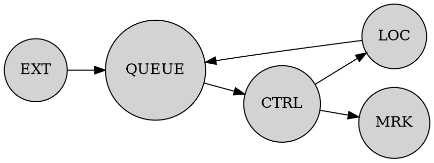

 
### ctrl-localite

A repository to control localite 4.0

### Command Line Tools

- localiteLSL

starts reading from localite TCP/IP-json and forwards all stimulation trigger
events as LSL Marker stream

- localiteMock

mocks a localite TCP/IP-json server for testing and development

### Information Flow

Packages are required to be a valid JSON

The EXT receives payloads via JSON over TCP-IP. Payloads have to have the form
`["fmt", "message", tstamp]`. Only the following fmts are valid: `["cmd", "mrk", "loc"]` and will be forwarded, all other payloads are ignored. Whether a message is valid, depends on the recipient and will be evaluated there.